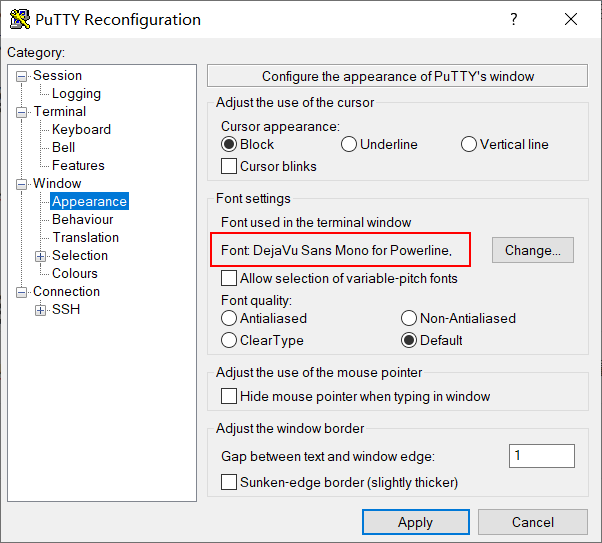
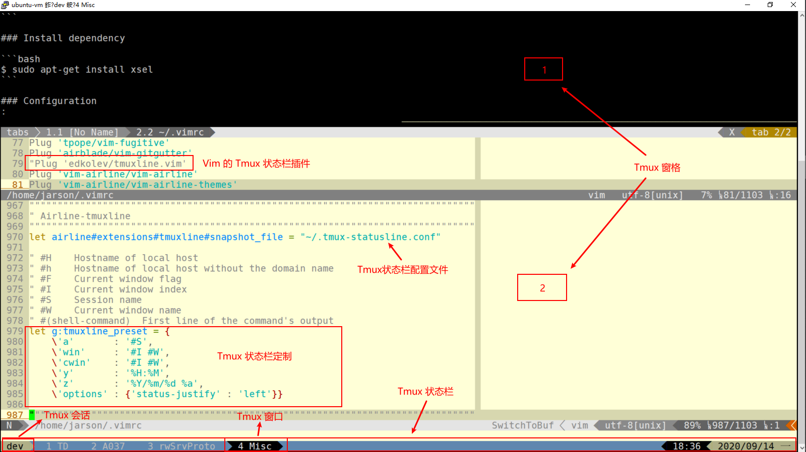
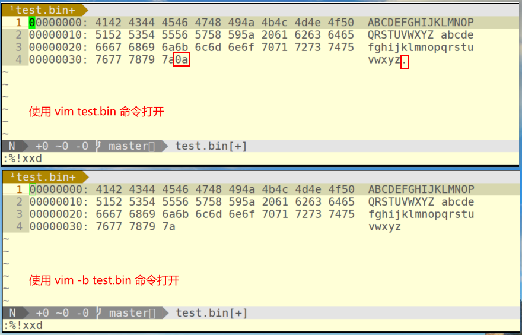
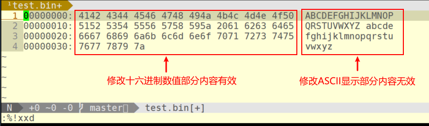
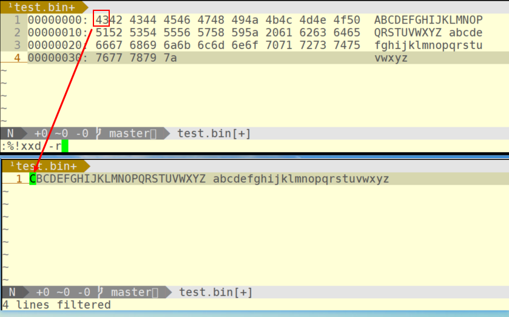

# 使用Tmux + Vim + Git提高Coding效率

| 修订版本 | 修订时间   | 作者   | 备注                                |
| -------- | ---------- | ------ | ----------------------------------- |
| 1.0.0    | 2020-09-15 | 方黄彩 | 初始版本                            |
| 1.1.0    | 2020-09-16 | 方黄彩 | 补充 Tmux 相关内容，更新格式排版    |
| 1.2.0    | 2020-09-16 | 方黄彩 | 补充 Vim 命令模式说明，更新格式排版 |

## 前言

Tmux、Vim、Git是我个人日常开发工作中的三剑客，三者相互配合，各司其职，可以让我更加专注高效的完成编程开发工作（例如Coding的时候，可以丢掉鼠标，全键盘编码）。本文不会详细或过多的介绍这 3 个工具的背景知识（请参考学习文后给出的参考链接或资料），在此更多的是分享我个人的使用配置和经验。下面这张截图，基本展示了这3个工具配合工作的风采（当然，还有PuTTY终端，选择PuTTY，因为其界面足够简单，没有多余的菜单或工具按钮占用宝贵的屏幕空间）。


3个工具中，Tmux 和 Vim 都是高度可定制的，所以建议使用Git对其配置进行版本管理，并托管到GitHub、GitLab或Gitee（码云），方便自己可持续定制工具的使用配置，也方便自己在多台电脑中可复制的快速还原工作环境配置。

### 系统环境：

**OS**: Ubuntu 20.04.1 LTS

**Tmux**: tmux 3.0a

**Vim**: VIM - Vi IMproved 8.1

**Git**: git version 2.25.1

### 安装字体

Tmux 和 Vim 的状态栏显示需要一些特殊字体，所以需要提前安装并配置。

```bash
# For linux
$ git clone https://github.com/powerline/fonts.git
$ cd fonts && ./install.sh
```

**Note**：Github 访问速度较慢，可以使用Gitee替代的映像地址（例如：https://gitee.com/jarsonfang/fonts.git）。

Windows系统环境，可以单独下载某个Powerline字体，然后安装。

[DejaVu Sans Mono for Powerline.ttf](https://gitee.com/jarsonfang/fonts/blob/master/DejaVuSansMono/DejaVu%20Sans%20Mono%20for%20Powerline.ttf)

配置终端使用 **Powerline** 字体



## Tmux (Terminal multiplexer)

Tmux是一个十分强大、简单易用的工具，尤其适合需要通过SSH远程连接到服务器进行相关开发工作的场景。关于Tmux的使用，只要掌握**会话 (Session)**、**窗口 (Window)**、**窗格 (Pane)** 这3个概念就足够了，简单来说，Tmux可以创建多个会话（同一个服务器），在会话中可以创建多个窗口，在窗口中可以分割多个窗格。灵活使用会话、窗口、窗格功能，可以引申出多种工作模式，例如远程协助结对编程、区分不同项目组工作环境、同屏监控程序执行状态等。

### 安装及配置

```bash
# Install
$ sudo apt-get install tmux
$ sudo apt-get install xsel
# Configure
$ cd
$ git clone https://github.com/jarsonfang/tmux.git
$ ln -sf tmux/tmux.conf .tmux.conf
$ ln -sf tmux/tmux-statusline.conf .tmux-statusline.conf
# Command alias
$ echo "alias tmux='tmux -2'" >> ~/.bash_aliases
$ source ~/.bash_aliases
```

安装 `xsel` 软件包，是为了支持 Tmux 与系统剪贴板的复制和粘贴操作（仅适用OS内部终端，即不适用于远程连接终端）。

上述的配置命令，使用的是我个人的定制配置，其中的 `tmux.conf` 为 Tmux 的主配置文件， `.tmux-statusline.conf` 为 Tmux 状态栏配置文件，由 Vim 的 `tmuxline` 插件自动生成。

`tmux -2`  命令选项：

```bash
 -2            Force tmux to assume the terminal supports 256 colours.
```

启用 `-2` 命令选项解决 Tmux 窗口中 Vim 编辑器配色显示异常的问题。

Tmux 工作界面如下图所示：



### 常用操作和配置

#### 命令前缀键

Tmux 默认的命令前缀键为 `Ctrl-b` (Ctrl + b 按键组合)，也可以配置为 `Ctrl-a` （兼容 GNU Screen 操作习惯）。所谓的命令前缀键，即执行 Tmux 命令时，需在 Tmux 窗口中，先按下该命令前缀键组合，然后再执行命令按键操作。

```bash
#set -g prefix2 C-a                        # GNU-Screen compatible prefix
#bind C-a send-prefix -2
```

#### 设置历史记录行数

```bash
set -g history-limit 5000                 # boost history
```

#### 快捷编辑 / 加载配置文件

```bash
# edit configuration
bind e new-window -n '~/.tmux.conf' "sh -c '\${EDITOR:-vim} ~/.tmux.conf \
    && tmux source ~/.tmux.conf && tmux display \"~/.tmux.conf sourced\"'"

# reload configuration
bind r source-file ~/.tmux.conf \; display '~/.tmux.conf sourced'
```

执行 `Ctrl-b e` 命令，在新窗口中使用 Vim 编辑器编辑配置文件，执行 `Ctrl-b r` 命令，重新加载配置文件。

#### 快捷打开帮助文档窗口

```bash
# -- man page ------------------------------------------------------------------
bind M command-prompt "splitw -h 'exec man %%'"
```

执行 `Ctrl-b M` 命令，以横分屏方式打开显示帮助文档窗口

#### 打开 / 关闭鼠标选择复制模式

```bash
# -- toggle mouse --------------------------------------------------------------
bind m run "cut -c3- ~/.tmux.conf | sh -s toggle_mouse"
```

执行 `Ctrl-b m` 命令打开 / 关闭鼠标选择复制模式。

#### 会话（Session）相关

##### 创建会话

```bash
$ tmux new -s <session_name>
```

##### 列举会话

```bash
$ tmux ls
```

##### 分离会话

在 Tmux 窗口中执行 `Ctrl-b d` 命令。

##### 连接会话

```bash
$ tmux at
```

如果有多个会话存在，需要加 `-t` 参数指定所连接的目标会话。

```bash
jarson@ubuntu-vm:~$ tmux ls
dev: 4 windows (created Tue Sep  1 12:36:58 2020)
jarson@ubuntu-vm:~$ tmux at -t dev
```

##### 选择会话

在 Tmux 窗口中执行 `Ctrl-b s` 命令。

##### 重命名会话名称

在 Tmux 窗口中执行 `Ctrl-b $` 命令。

#### 窗口（Window）相关

##### 垂直分割窗口

```bash
# window split
bind - splitw -v -c "#{pane_current_path}"  # vertical split (prefix -)
# default binding: '"' Split the current pane into two, top and bottom.
```

在 Tmux 窗口中执行 `Ctrl-b -` 命令 （默认命令为 `Ctrl-b "`）。

##### 水平分割窗口

```bash
# window split
bind | splitw -h -c "#{pane_current_path}"  # horizontal split (prefix |)
# default binding: '%' Split the current pane into two, left and right.
```

在 Tmux 窗口中执行 `Ctrl-b |` 命令 （默认命令为 `Ctrl-b %`）。

##### 重命名窗口

在 Tmux 窗口中执行 `Ctrl-b ,` 命令。

##### 移动窗口

在 Tmux 窗口中执行 `Ctrl-b .` 命令。

##### 创建窗口

```bash
# create a new window based on current pane path
# bind c new-window -c "#{pane_current_path}"
```

在 Tmux 窗口中执行 `Ctrl-b c` 命令创建新窗口，默认工作目录为用户的主目录。

##### 关闭窗口

```bash
bind ^q killw             # kill window (prefix Ctrl+q)
# default binding: '&' Kill the current window.
```

在 Tmux 窗口中执行 `Ctrl-b Ctrl-q` 命令关闭当前窗口（默认命令为 `Ctrl-b &`）。

##### 跳转回上一次活动的窗口

```bash
# window navigation
bind Tab last-window      # move to last active window (prefix Tab)
```

在 Tmux 窗口中执行  `Ctrl-b [Tab]` 命令。

#### 窗格（Pane）相关

##### 移动（交换）窗格

```bash
# pane swap
bind < swap-pane -U       # swap current pane with the previous one (prefix <)
# default binding: '{' Swap the current pane with the previous pane.
bind > swap-pane -D       # swap current pane with the next one (prefix >)
# default binding: '}' Swap the current pane with the next pane.
```

在 Tmux 窗格中执行 `Ctrl-b <` 或者 `Ctrl-b >`  （默认命令分别为 `Ctrl-b {` 和 `Ctrl-b }`）。

##### 窗格导航（切换）

```bash
# pane navigation
bind -r k select-pane -U # move up (prefix k)
bind -r j select-pane -D # move down (prefix j)
bind -r h select-pane -L # move left (prefix h)
bind -r l select-pane -R # move right (prefix l)
# default bindings:
# Up, Down
# Left, Right
#   Change to the pane above, below, to the left, or to the right of the current pane.
```

在 Tmux 窗格中执行 `Ctrl-b k/j/h/l` (Vim风格)实现上/下/左/右窗格切换。

默认命令是 `Ctrl-b Up/Down/Left/Right` (Up表示键盘的向上箭头按键，其他类推)。

##### 跳转回上一次活动的窗格

```bash
# default binding: ';' Move to the previously active pane.
```

在 Tmux 窗格中执行 `Ctrl-b ;` 命令。

##### 调整窗格大小

```bash
# pane resizing
bind -r ^k resize-pane -U # upward (prefix Ctrl+k)
bind -r ^j resize-pane -D # downward (prefix Ctrl+j)
bind -r ^h resize-pane -L # to the left (prefix Ctrl+h)
bind -r ^l resize-pane -R # to the right (prefix Ctrl+l)
```

在 Tmux 窗格中执行 `Ctrl-b Ctrl-k/j/h/l` (Vim风格)实现上/下/左/右调整窗格大小。

##### 窗格缩放 (zoom)

在 Tmux 窗格中执行 `Ctrl-b z` 命令。

##### 关闭窗格

```bash
bind q killp              # kill pane (prefix q)
# default binding: 'x' Kill the current pane.
```

在 Tmux 窗格中执行 `Ctrl-b q` 或者 `exit` 命令关闭当前窗格（默认命令为 `Ctrl-b x`）。

#### 复制和粘贴

```bash
# -- copy mode -----------------------------------------------------------------
setw -g mode-keys vi

bind Enter copy-mode  # enter copy mode
# default binding: '[' Enter copy mode to copy text or view the history.
bind P paste-buffer   # paste from the top pate buffer
# default binding: ']' Paste the most recently copied buffer of text.
```

执行 `Ctrl-b Enter` （默认命令为 `Ctrl-b [`）命令进入复制模式 （复制模式的按键映射可配置为 Vi 模式或者 Emacs 模式），在复制模式下按 `Esc` 键退出复制模式。

##### 文本复制

以 Vi 复制模式（copy-mode-vi）为例（不熟悉Emacs😄），进入复制模式之后，然后按照 Vi 编辑器的操作方式进行文本内容选择和复制操作，执行文本内容复制操作之后，会自动退出复制模式。

##### 文本粘贴

执行 `Ctrl-b P` （默认命令为 `Ctrl-b ]`）命令进行文本内容粘贴。

##### 与系统剪贴板的互操作

```bash
# -- clipboard -----------------------------------------------------------------
bind C-c run "tmux save-buffer - | xsel -ib"
bind C-v run "tmux set-buffer \"$(xsel -ob)\"; tmux paste-buffer"
```

仅支持 OS 内部终端程序，不适用远程连接终端，需配合 `xsel` 程序使用。

###### 复制 Tmux 窗口内容到系统剪贴板

在复制模式下完成文本内容选择和复制操作之后，再执行命令 `Ctrl-b Ctrl-c` 命令复制文本内容到系统剪贴板。

###### 复制系统剪贴板内容到 Tmux 窗口

执行 `Ctrl-b Ctrl-v` 命令，可粘贴系统剪贴板内容到 Tmux 窗口。

## Vim (Vi IMproved)

Vim 是一个古老且功能强大的支持多种模式的编辑器，在网络上被尊称为“编辑器之神”，与另外一个功能同样十分强大的编辑器Emacs（“神的编辑器”）难分伯仲。我不是神，所以选择了Vim😄。

所以，熟悉 Vim 的不同模式，是掌握 Vim 编辑器使用的诀窍之一。Vim 默认情况下处于**正常（Normal）模式**，在其他任何模式下，按 Esc 键都会回到正常模式。Vim 在**插入（Insert）模式**下进行文本内容输入，在**可视（Visual）模式**下进行文本内容选择，Vim 还支持**命令（Command）模式**，执行命令或脚本操作。

除了前述常见的 4 种模式，在正常模式下，按下大写按键 R ，Vim 会进入**替换（Replace）模式**，可视模式根据触发按键（v / Ctrl-v）的不同，还会细分为**普通的可视模式（Visual）**和**块选择可视模式（Visual Block）**。

对 Vim 命令模式的理解，可以认为是**行编辑模式**，其功能由古老的行编辑器 **ex** 衍生发展而来，Linux系统中常见的grep、sed、awk等命令，与 Vim 皆可认为是师承一脉，继承并拓展了行编辑器的功能。

### 安装及配置

```bash
# Install
$ sudo apt-get install vim
# Configure
$ cd
$ rm -rf .vim .vimrc
$ git clone https://github.com/jarsonfang/vimconfig.git
$ ln -s vimconfig/vim .vim
$ ln -s vimconfig/vimrc .vimrc
```

### 插件和配置介绍

#### 常规配置

##### 配置文件和终端字符编码

```bash
" Set utf8 as standard encoding
set encoding=utf-8
set termencoding=utf-8
set fileencodings=ucs-bom,utf-8,chinese,cp936
```

##### 配置按键映射前缀键

```bash
" With a map leader it's possible to do extra key combinations
" like <Leader>w saves the current file
let mapleader = ","
let g:mapleader = ","
```

##### 配置语法高亮和配色方案

```bash
"""""""""""""""""""""""""""""""""""""""""""""""""""""""""""""""""""""""""""""""
"  Syntax and colorscheme
"""""""""""""""""""""""""""""""""""""""""""""""""""""""""""""""""""""""""""""""
" Workaround with tmux terminal
if exists('$TMUX')
  set term=screen-256color
endif

set t_Co=256 " Explicitly tell Vim that the terminal supports 256 colors

" Switch syntax highlighting on, when the terminal has colors
" Also switch on highlighting the last used search pattern.
if has("syntax")
  syntax on
endif

if &t_Co > 2 || has("gui_running")
  syntax enable
"  set hlsearch
endif

set conceallevel=2

"if has('gui_running')
"    set background=light
"else
"    set background=dark
"endif

set background=light

if &background == "light"
    let g:solarized_termcolors=256
    colorscheme solarized_my
else
    let g:rehash256=1
    colorscheme molokai_my
endif
```

##### 配置窗口显示界面

```bash
"""""""""""""""""""""""""""""""""""""""""""""""""""""""""""""""""""""""""""""""
" User interface
"""""""""""""""""""""""""""""""""""""""""""""""""""""""""""""""""""""""""""""""
" Turn on the WiLd menu
set wildmenu

" Always show current position
set ruler

" Show line number
set number

" display incomplete commands
set showcmd

" Height of the command bar
set cmdheight=1

" Highlight the cursor line
set cursorline

" Set borderline (or reference line)
set colorcolumn=80 " or set cc=80, use set cc= to unset the option
"hi ColorColumn ctermbg=black

" allow backspacing over everything in insert mode
set backspace=indent,eol,start
set whichwrap+=<,>,h,l
```

##### 配置空白符缩进和显示

```bash
"""""""""""""""""""""""""""""""""""""""""""""""""""""""""""""""""""""""""""""""
" Tab & Spaces
"""""""""""""""""""""""""""""""""""""""""""""""""""""""""""""""""""""""""""""""
" Expand tab with spaces
"set expandtab
"set tabstop=4
"set shiftwidth=4
set et ts=4 sw=4

set smarttab
set softtabstop=-1
nmap <Leader>rt :retab!<CR>

" Show tabs and trails
set list listchars=tab:→·,trail:·
```

##### 配置窗口、标签页、文件缓存等操作按键映射

```bash
"""""""""""""""""""""""""""""""""""""""""""""""""""""""""""""""""""""""""""""""
" Moving around, tabs, windows and buffers
"""""""""""""""""""""""""""""""""""""""""""""""""""""""""""""""""""""""""""""""
" Treat long lines as break lines (useful when moving around in them)
map j gj
map k gk

" Don't use Ex mode, use Q for formatting
map Q gq

" Remap VIM 0 to first non-blank character
"map 0 ^

" Window moving cursor
nmap wh <C-W>h
nmap wj <C-W>j
nmap wk <C-W>k
nmap wl <C-W>l

" Window resizing
nmap <C-h> <C-W><
nmap <C-j> <C-W>-
nmap <C-k> <C-W>+
nmap <C-l> <C-W>>

" Window moving around
" Exchange current window with next one
nmap <C-x> <C-W>x

"<C-W> K Move the current window to be at the very top
"<C-W> J Move the current window to be at the very bottom
"<C-W> H Move the current window to be at the far left
"<C-W> L Move the current window to be at the far right

" Useful mappings for managing tabs
nmap <Leader>ta :tabnew<CR>
nmap <Leader>tn :tabnext<CR>
nmap <Leader>tp :tabprevious<CR>
nmap <Leader>to :tabonly<CR>
nmap <Leader>tc :tabclose<CR>

" Opens a new tab with the current buffer's path
" Super useful when editing files in the same directory
nmap <Leader>te :tabedit <c-r>=expand("%:p:h")<CR>/

" Switch CWD to the directory of the open buffer
nmap <Leader>cd :cd %:p:h<CR>:pwd<CR>

" Edit file
nmap <Leader>e :edit<Space>

" Save file
nmap <Leader>w :w!<CR>
nmap <Leader>wa :wa!<CR>
nmap <Leader>wq :wq!<CR>

" Quit window
nmap <Leader>q :q!<CR>
nmap <Leader>qa :qa!<CR>

" Split window
nmap <Leader>hs :split<CR>

" Split window vertical
nmap <Leader>vs :vsplit<CR>

" Toggle paste mode on and off
nmap <Leader>p :setlocal paste!<CR>

" Buffer operations
nmap <Leader>ls :ls<CR>
" the :ls command is the same as :buffers
nmap <Leader>b  :buffer<Space>
nmap <Leader>bd :bdelete<CR>
nnoremap <C-N>  :bnext<CR>
nnoremap <C-P>  :bprevious<CR>
```

##### 配置快速编辑 vimrc 按键映射

```bash
"""""""""""""""""""""""""""""""""""""""""""""""""""""""""""""""""""""""""""""""
" Fast edit vimrc
"""""""""""""""""""""""""""""""""""""""""""""""""""""""""""""""""""""""""""""""
function! SwitchToBuf(filename)
    "let fullfn = substitute(a:filename, "^\\~/", $HOME . "/", "")
    " find in current tab
    let bufwinnr = bufwinnr(a:filename)
    if bufwinnr != -1
        exec bufwinnr . "wincmd w"
        return
    else
        " find in each tab
        tabfirst
        let tab = 1
        while tab <= tabpagenr("$")
            let bufwinnr = bufwinnr(a:filename)
            if bufwinnr != -1
                exec "normal " . tab . "gt"
                exec bufwinnr . "wincmd w"
                return
            endif
            tabnext
            let tab = tab + 1
        endwhile
        " not exist, new tab
        exec "tabnew " . a:filename
    endif
endfunction

"Fast reloading of the .vimrc
nmap <Leader>sv :source ~/.vimrc<CR>

"Fast editing of .vimrc
nmap <Leader>ev :call SwitchToBuf("~/.vimrc")<CR>
```

##### 配置 Man 文档按键映射

```bash
"""""""""""""""""""""""""""""""""""""""""""""""""""""""""""""""""""""""""""""""
" Man page
"""""""""""""""""""""""""""""""""""""""""""""""""""""""""""""""""""""""""""""""
source $VIMRUNTIME/ftplugin/man.vim
nmap <Leader>m :Man<Space>
```

##### 配置 Cscope 按键映射

```bash
"""""""""""""""""""""""""""""""""""""""""""""""""""""""""""""""""""""""""""""""
" Cscope
"""""""""""""""""""""""""""""""""""""""""""""""""""""""""""""""""""""""""""""""
" Manual (see :help cscope)
"
" Excute commands below in the project root dir to generate cscope database:
"   find -type f > cscope.files
"   cscope -bq
" Or
"   cscope -bRq
" Generated files: cscope.files, cscope.in.out, cscope.out, cscope.po.out.
"
if has("cscope")
  set csprg=/usr/bin/cscope
  set csqf=s-,c-,d-,i-,t-,e-
  set csto=1
  set cst
  set nocsverb
  " add any database in current directory
  if filereadable("cscope.out")
      cs add cscope.out
  " else add database pointed to by environment
  elseif $CSCOPE_DB != ""
      cs add $CSCOPE_DB
  endif
  set csverb
endif

" 0 or s: Find this C symbol
nmap <Leader>fs :cs find s <C-R>=expand("<cword>")<CR><CR>
" 1 or g: Find this definition
"nmap <Leader>fg :cs find g <C-R>=expand("<cword>")<CR><CR>
nmap <Leader>fd :cs find g <C-R>=expand("<cword>")<CR><CR>
" 2 or d: Find functions called by this function
"nmap <Leader>fd :cs find d <C-R>=expand("<cword>")<CR><CR>
nmap <Leader>fr :cs find d <C-R>=expand("<cword>")<CR><CR>
" 3 or c: Find functions calling this function
nmap <Leader>fc :cs find c <C-R>=expand("<cword>")<CR><CR>
" 4 or t: Find this text string
nmap <Leader>ft :cs find t <C-R>=expand("<cword>")<CR><CR>
" 6 or e: Find this egrep pattern
nmap <Leader>fe :cs find e <C-R>=expand("<cword>")<CR><CR>
" 7 or f: Find this file
"nmap <Leader>ff :cs find f <C-R>=expand("<cfile>")<CR><CR>
nmap <Leader>fg :cs find f <C-R>=expand("<cfile>")<CR><CR>
" 8 or i: Find files #including this file
nmap <Leader>fi :cs find i ^<C-R>=expand("<cfile>")<CR>$<CR>
```

#### 插件管理器

比较有名气的 Vim 插件管理器有 vundle（已好久没有更新）和 vim-plug（目前更新维护还比较活跃），如同 Tmux 是 GNU Screen 的增强版，vim-plug 应该也算是 vundle 的增强版（两者的配置比较相似）。在使用插件管理器之前，Vim 的各种插件靠手动管理维护，配置繁琐且难以维护，无疑抬高了 Vim 的使用门槛。在偶然发现 Vim 的插件管理器之后，我才得以重新尝试并坚持使用 Vim ，然后慢慢的发现 Vim 其他功能强大的插件，最终将 Vim 打造成为我日常开发工作中的利器。

[Vundle.vim](https://github.com/VundleVim/Vundle.vim)

[vim-plug](https://github.com/junegunn/vim-plug)

##### vim-plug

###### vim-plug 安装：

```bash
"""""""""""""""""""""""""""""""""""""""""""""""""""""""""""""""""""""""""""""""
" vim-plug (Minimalist Vim Plugin Manager)
"""""""""""""""""""""""""""""""""""""""""""""""""""""""""""""""""""""""""""""""
" Download plug.vim and put it in the 'autoload' directory.
" curl -fLo ~/.vim/autoload/plug.vim --create-dirs \
"     https://raw.githubusercontent.com/junegunn/vim-plug/master/plug.vim

" Automatic installation
if empty(glob('~/.vim/autoload/plug.vim'))
    silent !curl -fLo ~/.vim/autoload/plug.vim --create-dirs
        \ https://gitee.com/jarsonfang/vim-plug/raw/master/plug.vim
    autocmd VimEnter * PlugInstall --sync | source $MYVIMRC
endif
```

###### vim-plug 配置示例：

```bash
" Specify a directory for plugins
" - For Neovim: stdpath('data') . '/plugged'
" - Avoid using standard Vim directory names like 'plugin'
call plug#begin('~/.vim/plugged')

" Make sure you use single quotes

" Shorthand notation; fetches https://github.com/junegunn/vim-easy-align
Plug 'junegunn/vim-easy-align'

" Any valid git URL is allowed
Plug 'https://github.com/junegunn/vim-github-dashboard.git'

" Multiple Plug commands can be written in a single line using | separators
Plug 'SirVer/ultisnips' | Plug 'honza/vim-snippets'

" On-demand loading
Plug 'scrooloose/nerdtree', { 'on':  'NERDTreeToggle' }
Plug 'tpope/vim-fireplace', { 'for': 'clojure' }

" Using a non-default branch
Plug 'rdnetto/YCM-Generator', { 'branch': 'stable' }

" Using a tagged release; wildcard allowed (requires git 1.9.2 or above)
Plug 'fatih/vim-go', { 'tag': '*' }

" Plugin options
Plug 'nsf/gocode', { 'tag': 'v.20150303', 'rtp': 'vim' }

" Plugin outside ~/.vim/plugged with post-update hook
Plug 'junegunn/fzf', { 'dir': '~/.fzf', 'do': './install --all' }

" Unmanaged plugin (manually installed and updated)
Plug '~/my-prototype-plugin'

" Initialize plugin system
call plug#end()
```

###### vim-plug 命令：

| Command                             | Description                                                  |
| ----------------------------------- | ------------------------------------------------------------ |
| `PlugInstall [name ...] [#threads]` | Install plugins                                              |
| `PlugUpdate [name ...] [#threads]`  | Install or update plugins                                    |
| `PlugClean[!]`                      | Remove unlisted plugins (bang version will clean without prompt) |
| `PlugUpgrade`                       | Upgrade vim-plug itself                                      |
| `PlugStatus`                        | Check the status of plugins                                  |
| `PlugDiff`                          | Examine changes from the previous update and the pending changes |
| `PlugSnapshot[!] [output path]`     | Generate script for restoring the current snapshot of the plugins |

#### 精品插件

##### CtrlP

 [kien/ctrlp.vim](https://github.com/kien/ctrlp.vim)

一款媲美 SourceInsight 文件搜索功能的杀手级别插件，

借鉴 Sublime Text 编辑器CtrlP（按键组合）文件搜索功能开发实现。

##### vim-easymotion

 [easymotion/vim-easymotion](https://github.com/easymotion/vim-easymotion)

一款可以让你丢掉鼠标，实现全键盘编码的杀手级别插件。

（VSCode编辑器的Vim模式也默认集成了该插件）

##### YouCompleteMe

[Valloric/YouCompleteMe](https://github.com/Valloric/YouCompleteMe)

一款功能强大的代码补全、语法/语义分析的杀手级别插件。

##### vim-airline / vim-airline-themes

[vim-airline/vim-airline](https://github.com/vim-airline/vim-airline)

[vim-airline/vim-airline-themes](https://github.com/vim-airline/vim-airline-themes)

Vim 状态栏 / 主题

##### NerdTree

[scrooloose/nerdtree](https://github.com/scrooloose/nerdtree)

文件树浏览器

##### NerdCommenter

[scrooloose/nerdcommenter](https://github.com/scrooloose/nerdcommenter)

文本注释

##### tagbar

[majutsushi/tagbar](https://github.com/majutsushi/tagbar)

文件标签浏览，配合 ctags 使用。

```bash
sudo apt install universal-ctags
```

##### vim-grepper

[mhinz/vim-grepper](https://github.com/mhinz/vim-grepper)

文本搜索，可配合 ag 程序使用。

```bash
sudo apt install silversearcher-ag
```

##### sessionman

[vim-scripts/sessionman.vim](https://github.com/vim-scripts/sessionman.vim)

会话管理

##### TaskList

[vim-scripts/TaskList.vim](https://github.com/vim-scripts/TaskList.vim)

任务管理：TODO 或 FIXME 标记

##### a.vim

[vim-scripts/a.vim](https://github.com/vim-scripts/a.vim)

头文件 / 源文件 切换，头文件和源文件需位于同一个目录下。

##### IndentLine

[Yggdroot/indentLine](https://github.com/Yggdroot/indentLine)

缩进对齐线

##### vim-repeat / vim-surround / auto-pairs

[tpope/vim-repeat](https://github.com/tpope/vim-repeat)

[tpope/vim-surround](https://github.com/tpope/vim-surround)

[jiangmiao/auto-pairs](https://github.com/jiangmiao/auto-pairs)

括号、引号自动配对

##### vim-fugitive / vim-gitgutter

[tpope/vim-fugitive](https://github.com/tpope/vim-fugitive)

[airblade/vim-gitgutter](https://github.com/airblade/vim-gitgutter)

与 Git 版本管理互操作相关

##### vim-trailing-whitespace

[bronson/vim-trailing-whitespace](https://github.com/bronson/vim-trailing-whitespace)

删除文本行末尾多余空白符，配合 `:retab!` 命令使用，可快速清除代码行中多余的空白符。

##### tmuxline

[edkolev/tmuxline.vim](https://github.com/edkolev/tmuxline.vim)

Tmux 状态栏配置生成器

### 命令模式（行编辑模式）

#### 查看和编辑二进制文件

查看或编辑二进制文件时，使用 Vim 需指定 `-b` 参数启用二进制模式，否则 Vim 会将所编辑的文件视为普通文件，并自作聪明的在文件行末尾增加 `0x0a` (LF) 换行符。Vim 本身并不能直观的显示二进制文件内容，需配合 xxd (make a hexdump or do the reverse) 程序实现二进制文件内容的查看和编辑。

xxd 程序使用说明：

```bash
$ xxd --help
Usage:
       xxd [options] [infile [outfile]]
    or
       xxd -r [-s [-]offset] [-c cols] [-ps] [infile [outfile]]
Options:
    -a          toggle autoskip: A single '*' replaces nul-lines. Default off.
    -b          binary digit dump (incompatible with -ps,-i,-r). Default hex.
    -C          capitalize variable names in C include file style (-i).
    -c cols     format <cols> octets per line. Default 16 (-i: 12, -ps: 30).
    -E          show characters in EBCDIC. Default ASCII.
    -e          little-endian dump (incompatible with -ps,-i,-r).
    -g          number of octets per group in normal output. Default 2 (-e: 4).
    -h          print this summary.
    -i          output in C include file style.
    -l len      stop after <len> octets.
    -o off      add <off> to the displayed file position.
    -ps         output in postscript plain hexdump style.
    -r          reverse operation: convert (or patch) hexdump into binary.
    -r -s off   revert with <off> added to file positions found in hexdump.
    -s [+][-]seek  start at <seek> bytes abs. (or +: rel.) infile offset.
    -u          use upper case hex letters.
    -v          show version: "xxd V1.10 27oct98 by Juergen Weigert".
```

##### 操作示例

**创建一个二进制文件**

```bash
$ echo -n "ABCDEFGHIJKLMNOPQRSTUVWXYZ abcdefghijklmnopqrstuvwxyz" > test.bin
```

注意 echo 一定要跟上 `-n` 选项，否则会被自动加上一个 LF 换行符（类似 Vim 不指定 `-b` 参数打开二进制文件）。

**使用 Vim 打开二进制文件，并以十六进制方式显示文件内容**

分别使用 `vim test.bin` 和 `vim -b test.bin` 命令打开 `test.bin` 文件，然后在**命令模式**下调用 `xxd` 命令（以十六进制方式）查看文件内容。



**编辑 `xxd` 命令转换后的内容，然后执行 `xxd -r` 命令将文件内容转换回二进制格式**





**最后在命令模式中执行 `:wq` 保存退出。**

**注**：必须是在执行 `xxd -r` 命令将文件内容转换回二进制之后再执行 `:wq` 命令保存文件，否则保存的则是二进制文件内容的十六进制显示文本。

##### 命令解释

```bash
:%!xxd
```

`:` 号表示 Vim 命令模式（注：执行 `/` 或 `?` 搜索字符时也可认为是一种命令模式）。

`%` 号表示所有**文件行**范围。

`!` 号表示调用外部程序。

`xxd` 为外部程序名称。

#### dos 和 unix 文件编码转换

需要安装 `dos2unix` 程序：

```bash
$ apt-cache search dos2unix
dos2unix - convert text file line endings between CRLF and LF
$ apt-cache search unix2dos
dos2unix - convert text file line endings between CRLF and LF
$ sudo apt install dos2unix
```

##### 文件编码转换

**dos2unix**

```bash
:!dos2unix %
```

**unix2dos**

```bash
:!unix2dos %
```

##### 命令解释

`%` 为 Vim 内建变量，表示当前文件。

##### 重新加载文件

```bash
:edit
```

命令的默认参数为当前文件，即 `%` 变量。

## Git

关于 Git 的使用，这里不作过多展开，大家可以学习 Git 的官方教程。我个人认为，只要理解了 Git 的**工作区**、**暂存区**、**本地仓库**、**远程仓库** 这几个概念，那么就很容易理解 Git 的操作命令以及使用 Git 的开发模式及其思想。

我使用 Git 的个人配置：

```bash
$ git config --list
user.name=fanghuangcai
user.email=fanghuangcai@163.com
alias.ci=commit
alias.co=checkout
alias.br=branch
alias.st=status
alias.au=add -u
alias.ca=commit --amend
color.ui=auto
push.default=simple
core.safecrlf=true
```

### 基于 Git 实现的代码托管服务

目前比较有名的 Git 代码托管服务：

国外（网络访问速度较慢）：GitHub、GitLab

国内（网络访问速度较快）：Gitee （码云）

注：Gitee 可导入 GitHub 或 GitLab 仓库， 迂回解决访问 GitHub 或 GitLab 速度慢的问题。

## 参考

**Tmux**

1. [Tmux 使用教程](https://www.ruanyifeng.com/blog/2019/10/tmux.html)
2. [ssh的最佳伴侣-tmux](https://www.jianshu.com/p/b67567085856)

**Vim**

1. [Vim用户手册中文版-V7.2](https://gitee.com/jarsonfang/vimconfig/tree/master/doc)
2. [在Linux下使用vim配合xxd查看并编辑二进制文件](https://www.cnblogs.com/killkill/archive/2010/06/23/1763785.html)

**Git**

1. [Git - Book](https://git-scm.com/book/zh/v2)（官方教程）
